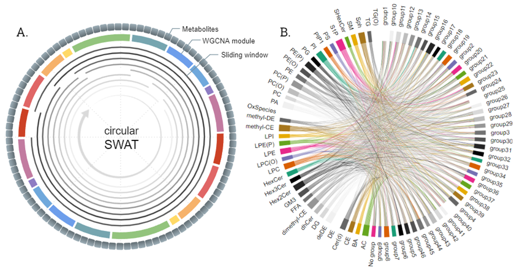

# c-SWAT: Circular-Sliding Window Association Test 

## Overview

The circular-Sliding Window Association Test (c-SWAT) is a novel deep learning approach that considers correlations between features, utilizing modules such as WGCNA (Weighted Gene Co-expression Network Analysis) to enhance classification prediction performance.


### Execution Examples

For wgcna module:
```bash
python c-SWAT.py data/ADNI_norm.csv data/wgcna.txt
```

For classes module:
```bash
python c-SWAT.py data/ADNI_norm.csv data/classes.txt
```

## Contact

For questions or support, please contact [tjo(at)iu.edu].

:bookmark: **c-SWAT citation:**

> (Currently under review)

:bookmark: **Example of SWAT application:**

> Jo, Taeho, et al. "Deep learning-based identification of genetic variants: application to Alzheimer’s disease classification." Briefings in Bioinformatics 23.2 (2022)
