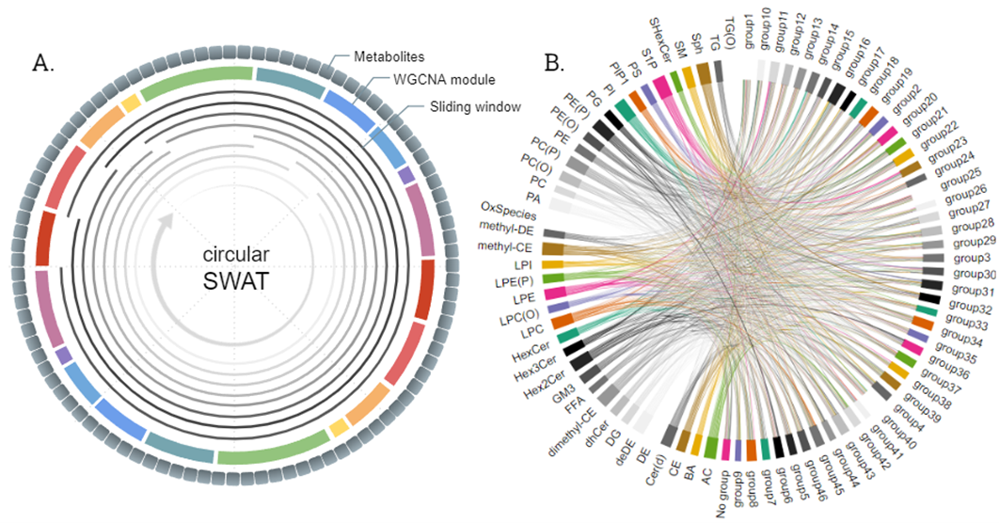

# c-SWAT: Circular-Sliding Window Association Test 

## Overview

The circular-Sliding Window Association Test (c-SWAT) is a novel deep learning approach that considers correlations between features, utilizing modules such as WGCNA (Weighted Gene Co-expression Network Analysis) to enhance classification prediction performance.


## Requirements
- Python 3.6.10
- For other dependencies, check `requirements.txt`.

### Execution Examples

```bash
python c-SWAT.py data/ADNI_norm.csv data/wgcna.txt data/classes.txt 
```


## Contact

For questions or support, please contact [tjo(at)iu.edu].

:bookmark: **c-SWAT citation:**

> Jo, Taeho, et al. "Circular-SWAT for deep learning based diagnostic classification of Alzheimer’s disease: Application to metabolome data." eBioMedicine (accepted, 2023)

:bookmark: **Example of SWAT application:**

> Jo, Taeho, et al. "Deep learning-based identification of genetic variants: application to Alzheimer’s disease classification." Briefings in Bioinformatics (2022)
